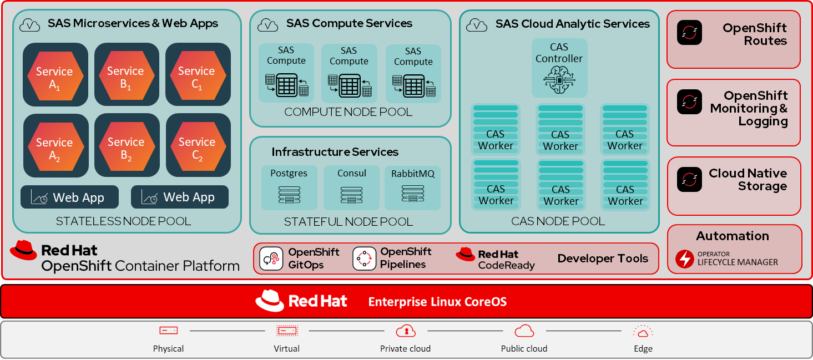

# SAS Viya Platform with Red Hat OpenShift

## Introduction

This repo is a companion to the two-part blog series with technical information about the SAS Viya Platform with Red Hat OpenShift published on the Red Hat blog web site.
* [Part 1](https://www.redhat.com/en/blog/sas-viya-on-red-hat-openshift-part-1-reference-architecture-and-deployment-considerations) provides essential technical information about SAS Institute's SAS Viya platform, as well as a reference architecture for deploying SAS Viya on Red Hat OpenShift. 

* [Part 2](https://www.redhat.com/en/blog/sas-viya-on-red-hat-openshift-part-2-security-and-storage-considerations) provides security, machine management and storage considerations. 

Here's a reference architecture diagram showing the SAS Viya platform installed on Red Hat OpenShift:

## OpenShift Machine Management
Example YAML files are provided here for the [`ClusterAutoScaler`](https://github.com/redhat-gpst/sas-viya-openshift/blob/main/clusterautoscaler.yaml), `MachineAutoScaler` and `MachineSet` definitions for node pool workload placement for SAS Viya on Red Hat OpenShift.

The following table provides the details about the `MachineAutoScaler` and `MachineSet` example definition files provided for each of the SAS Viya [Workload Classes](https://documentation.sas.com/?cdcId=itopscdc&cdcVersion=default&docsetId=dplyml0phy0dkr&docsetTarget=p0om33z572ycnan1c1ecfwqntf24.htm#n0jo17lrlk83rsn1vvs2wqmewkt7), based on the [minimum sizing recommendations for OpenShift](https://documentation.sas.com/?cdcId=itopscdc&cdcVersion=default&docsetId=itopssr&docsetTarget=n08i2gqb3vflqxn0zcydkgcood20.htm#p04uz29tbignsin10sk5ld8h6jn0).

|**Workload Class**|**Example MachineSet file**|**Example MachineAutoScaler file**|
| :- | :- | :- |
|
CAS workloads (SMP)

CAS workloads (MPP)
|
[`cas-smp-machineset.yaml`](https://github.com/redhat-gpst/sas-viya-openshift/blob/main/cas-smp-machineset.yaml)

[`cas-mpp-machineset.yaml`](https://github.com/redhat-gpst/sas-viya-openshift/blob/main/cas-mpp-machineset.yaml)
|
[`cas-smp-autoscaler.yaml`](https://github.com/redhat-gpst/sas-viya-openshift/blob/main/cas-smp-autoscaler.yaml)

[`cas-mpp-autoscaler.yaml`](https://github.com/redhat-gpst/sas-viya-openshift/blob/main/cas-mpp-autoscaler.yaml)
|
|Connect workloads|[`connect-machineset.yaml`](https://github.com/redhat-gpst/sas-viya-openshift/blob/main/connect-machineset.yaml)|[`connect-autoscaler.yaml`](https://github.com/redhat-gpst/sas-viya-openshift/blob/main/connect-autoscaler.yaml)|
|Compute workloads|[`compute-machineset.yaml`](https://github.com/redhat-gpst/sas-viya-openshift/blob/main/compute-machineset.yaml)|[`compute-autoscaler.yaml`](https://github.com/redhat-gpst/sas-viya-openshift/blob/main/compute-autoscaler.yaml)|
|Stateful workloads|[`stateful-machineset.yaml`](https://github.com/redhat-gpst/sas-viya-openshift/blob/main/stateful-machineset.yaml)|[`stateful-autoscaler.yaml`](https://github.com/redhat-gpst/sas-viya-openshift/blob/main/stateful-autoscaler.yaml)|
|Stateless workloads|[`stateless-machineset.yaml`](https://github.com/redhat-gpst/sas-viya-openshift/blob/main/stateless-machineset.yaml)|[`stateless-autoscaler.yaml`](https://github.com/redhat-gpst/sas-viya-openshift/blob/main/stateless-autoscaler.yaml)|

## SAS Viya Storage Requirements
Many SAS Viya components require highly performant storage, and SAS generally recommends a sequential I/O bandwidth of 90-120 MB per second, per physical CPU core. Normally this would be achieved by utilizing a storage system that is backed by using SSD or NVMe disks. SAS provides an automated utility script -- [rhel_iotest.sh](http://support.sas.com/kb/59/680.html), that uses UNIX/Linux dd commands to measure the I/O throughput of a file system in a Red Hat Enterprise Linux (RHEL) environment. This script can be used to compare the measured throughput of the storage in your environment to the recommendation. 

For more information, refer to [How to run the rhel_iotest.sh script on an OpenShift cluster](https://github.com/redhat-gpst/sas-viya-openshift/blob/main/how-to-run-the-rhel_iotest.sh-script-on-an-openshift-cluster.md).
